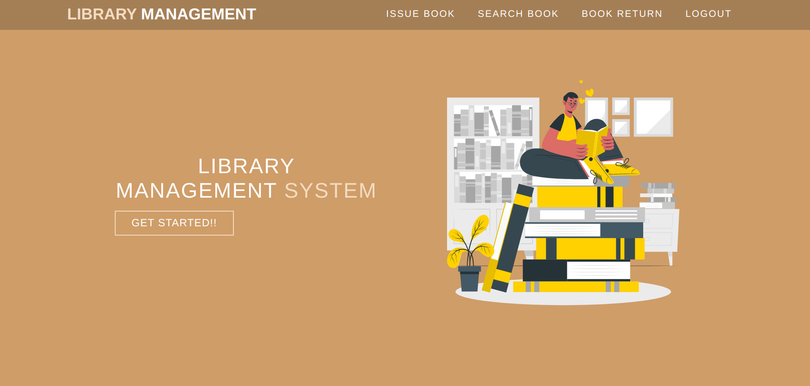
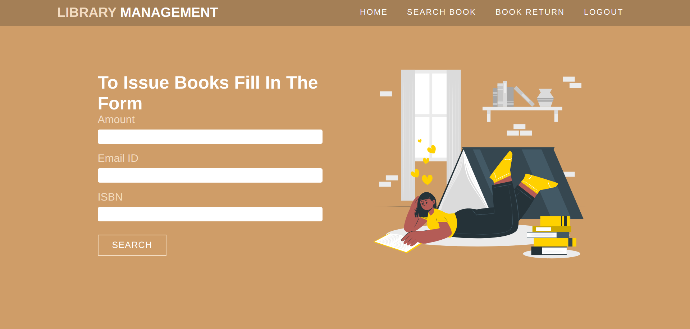
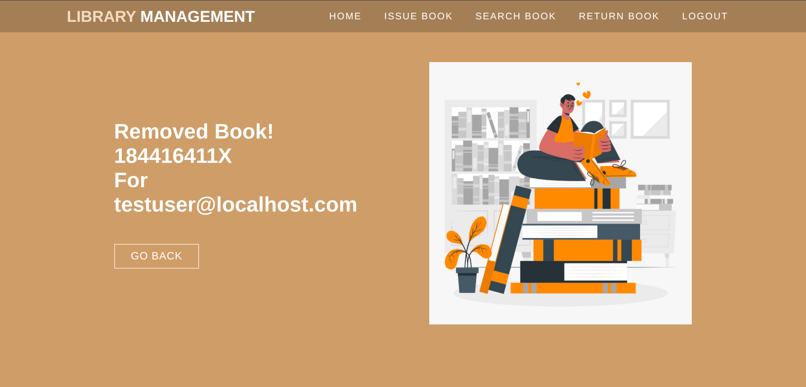

# dev-lib
## Login View

```email -> libuser@localhost.com ; password -> libuser```
## Home View


## Issue View



## Return View



## Search View


> git clone https://github.com/Aradhya-Tripathi/dev-lib 


``` 
cd dev-lib
pip install -r requirements.txt
export SECRET_KEY=localhost_secret_key
python3 server/run.py
```